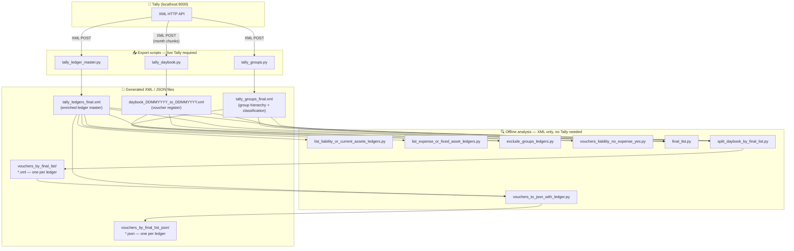
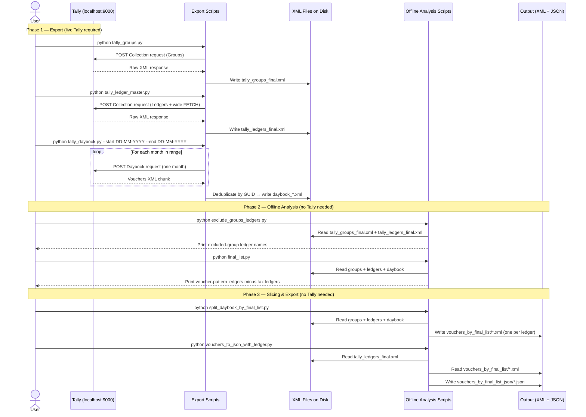

# TALLY_EXPORT


> **Python ETL toolkit for Tally Prime / Tally.ERP 9** — export groups, ledgers, and vouchers over the built-in XML HTTP API, then run rich offline analyses: ledger classification, tax-group closure, voucher pattern detection, and per-ledger JSON slicing.

---

## Table of Contents

- [Overview](#overview)
- [Features](#features)
- [Architecture](#architecture)
- [Workflow Diagram](#workflow-diagram)
- [Prerequisites & Installation](#prerequisites--installation)
- [Quick Start](#quick-start)
- [Script Reference](#script-reference)
  - [1. tally_groups.py](#1-tally_groupspy--group-master--classification)
  - [2. tally_ledger_master.py](#2-tally_ledger_masterpy--ledger-master--enrichment)
  - [3. tally_daybook.py](#3-tally_daybookpy--voucher-register)
  - [4. list_liability_or_current_assets_ledgers.py](#4-list_liability_or_current_assets_ledgerspy)
  - [5. list_expense_or_fixed_asset_ledgers.py](#5-list_expense_or_fixed_asset_ledgerspy)
  - [6. exclude_groups_ledgers.py](#6-exclude_groups_ledgerspy--exclude-groups-closure)
  - [7. vouchers_liability_no_expense_yes.py](#7-vouchers_liability_no_expense_yespy--cross-voucher-pattern)
  - [8. final_list.py](#8-final_listpy--voucher-pattern-ledgers-minus-duties--taxes)
  - [9. split_daybook_by_final_list.py](#9-split_daybook_by_final_listpy--per-ledger-daybook-slices)
  - [10. vouchers_to_json_with_ledger.py](#10-vouchers_to_json_with_ledgerpy--json-with-ledger-master)
- [Data File Reference](#data-file-reference)
- [Output Folder Structure](#output-folder-structure)
- [Key Design Patterns](#key-design-patterns)
- [Classification System](#classification-system)
- [JSON Output Structure](#json-output-structure)
- [What You Get (Example Scale)](#what-you-get-example-scale)
- [Troubleshooting](#troubleshooting)
- [Notes & Caveats](#notes--caveats)
- [License](#license)

---

## Overview

Tally Prime and Tally.ERP 9 expose an **XML HTTP API** on `localhost:9000` that can return group hierarchies, ledger masters, and voucher registers in XML format. This toolkit wraps that API with:

- **Export scripts** that pull data from a live Tally instance and write structured XML to disk.
- **Offline analysis scripts** that operate purely on those XML files — no Tally required — to classify ledgers, close the *Duties & Taxes* group tree, detect cross-entry voucher patterns, and produce per-ledger daybook slices with enriched JSON.

The entire pipeline is designed for **any Tally company and any date range**. Simply point the scripts at your Tally instance and the date range you need.

---

## Features

- **Complete group export** with automatic classification into `NATURE` (Asset / Liability / Income / Expense), `ROOTPRIMARY` (top-level group), and `FINANCIALSTATEMENT` (Balance Sheet / P&L).
- **Full ledger master export** with wide FETCH spec (GST, mailing, bank, tax details) and optional enrichment from the group hierarchy.
- **Chunked daybook export** — month-by-month to stay within Tally's HTTP timeout limits; deduplicates by GUID across chunks.
- **Ledger deduplication & merging** — normalises whitespace, merges duplicate ledger names with union semantics across scalar and list fields.
- **Streaming XML parsing** via `iterparse` + `elem.clear()` — handles multi-hundred-MB daybook files without loading the entire document into memory.
- **Exclude-groups BFS closure** — walks the group tree to collect all sub-groups of selected root groups (default: *Duties & Taxes*, *Cash-in-Hand*, *Bank Accounts*, *Branch / Divisions*), then lists ledgers whose parent sits in that set.
- **Cross-voucher pattern detection** — finds vouchers that simultaneously debit an expense/fixed-asset ledger and credit a liability/current-asset ledger.
- **Per-ledger daybook slicing** — one XML file per target ledger containing every voucher that references it.
- **JSON export with canonical field resolution** — resolves GST, PAN, state, pincode from multiple Tally storage locations; records `field_sources` for auditability.
- **Safe filename generation** — sanitises ledger names to valid filesystem paths with collision handling.

---

## Architecture



---

## Workflow Diagram

The sequence below shows how data moves through the system end-to-end.



---

## Prerequisites & Installation

### Tally setup

1. Open your company in **Tally Prime** or **Tally.ERP 9**.
2. Go to **F12 Configure → Advanced Configuration** (or **Gateway of Tally → F12**).
3. Enable **"Allow TDL XML HTTP API"** (or **"Enable HTTP server"**) and note the port (default **9000**).
4. Tally must remain open and listening while export scripts run.

### Python environment

```bash
# Python 3.10+ required (uses X | Y type-union syntax)
python --version

# Install the only runtime dependency
pip install requests
```

### Get the code

```bash
git clone https://github.com/<your-username>/TALLY_EXPORT.git
cd TALLY_EXPORT
```

---

## Quick Start

Run these five commands in order (adjust dates to your financial year):

```bash
# 1. Export group hierarchy
python tally_groups.py

# 2. Export enriched ledger master
python tally_ledger_master.py

# 3. Export vouchers for your date range
python tally_daybook.py --start 01-04-2024 --end 31-03-2025

# 4. Split daybook into per-ledger slices
python split_daybook_by_final_list.py

# 5. Convert slices to JSON with ledger master
python vouchers_to_json_with_ledger.py
```

After step 5 you have:
- `tally_groups_final.xml` — enriched group tree
- `tally_ledgers_final.xml` — enriched ledger master
- `daybook_<DDMMYYYY>_to_<DDMMYYYY>.xml` — full voucher register
- `vouchers_by_final_list/` — one XML per target ledger
- `vouchers_by_final_list_json/` — one JSON per target ledger

---

## Script Reference

### 1. `tally_groups.py` — Group master + classification

**Role:** Fetches all Tally groups via a Collection XML request, walks each group's parent chain to its root primary group, and writes `tally_groups_final.xml` with enrichment tags added.

| Field added | Meaning |
|---|---|
| `ROOTPRIMARY` | Top-level ancestor (e.g. `Current Liabilities`, `Indirect Expenses`) |
| `NATURE` | `Asset` / `Liability` / `Income` / `Expense` / `Primary` |
| `FINANCIALSTATEMENT` | `Balance Sheet` / `P&L` / `Root` |

**Output:** `tally_groups_final.xml` — root `<TALLYGROUPS>`, children `<GROUP>`.

**Run:**

```bash
python tally_groups.py
```

> ⚠️ **Warning:** This script executes at import time (no `if __name__ == "__main__"` guard). Do **not** `import tally_groups` as a library unless you intend to trigger a live HTTP request.

**Downstream consumers:** `exclude_groups_ledgers.py`, `final_list.py`, `split_daybook_by_final_list.py`.

---

### 2. `tally_ledger_master.py` — Ledger master + enrichment

**Role:** Fetches all ledgers with a wide `<FETCH>` spec (GST, mailing, bank, income-tax details), optionally merges duplicate names, optionally enriches with `ROOTPRIMARY` / `NATURE` / `FINANCIALSTATEMENT`, and writes `tally_ledgers_final.xml`.

**Default output:** `tally_ledgers_final.xml` — root `<TALLYLEDGERS>`, children `<LEDGER>` in native Tally subtree format.

**CLI flags:**

| Flag | Default | Effect |
|---|---|---|
| `--out PATH` | `tally_ledgers_final.xml` | Override output path |
| `--no-enrich` | enrichment on | Skip adding ROOTPRIMARY / NATURE |
| `--legacy-flat` | off | Use flat field list instead of native subtrees |
| `--beautify` | on | Strip `TYPE` attributes from XML |

**Run:**

```bash
python tally_ledger_master.py
python tally_ledger_master.py --out my_ledgers.xml
python tally_ledger_master.py --no-enrich
python tally_ledger_master.py --legacy-flat
```

**Programmatic API:**

```python
from tally_ledger_master import export_ledgers_to_path
export_ledgers_to_path("my_ledgers.xml")
```

**Downstream consumers:** All offline analysis scripts.

---

### 3. `tally_daybook.py` — Voucher register

**Role:** Exports vouchers for a given date range by fetching **one calendar month at a time** (to avoid Tally HTTP timeouts). Deduplicates by `GUID` across chunks. Normalises the XML to `<TALLYDAYBOOK>` / `<VOUCHER>` / `<LEDGERENTRIES>` / `<ENTRY>`.

**Output:** `daybook_DDMMYYYY_to_DDMMYYYY.xml` (auto-named from date range, or `--out`).

**CLI flags:**

| Flag | Default | Effect |
|---|---|---|
| `--start DD-MM-YYYY` | required | First date of range |
| `--end DD-MM-YYYY` | required | Last date of range |
| `--out PATH` | auto from dates | Override output path |

**Run:**

```bash
python tally_daybook.py --start 01-04-2024 --end 31-03-2025
python tally_daybook.py --start 01-04-2024 --end 31-03-2025 --out my_daybook.xml
```

**Programmatic API:**

```python
from tally_daybook import export_daybook_to_path
export_daybook_to_path("01-04-2024", "31-03-2025", "my_daybook.xml")
```

> **Timeouts:** 900 s read timeout per monthly chunk. Very large companies may still need smaller ranges or TDL-level optimisation.

**Downstream consumers:** `vouchers_liability_no_expense_yes.py`, `final_list.py`, `split_daybook_by_final_list.py`.

---

### 4. `list_liability_or_current_assets_ledgers.py`

**Role:** Reads the enriched ledger XML and prints one ledger name per line for every ledger where:

- `NATURE == "Liability"`, **or**
- `ROOTPRIMARY == "Current Assets"`

**Default input:** `tally_ledgers_final.xml` in the current directory.

**Run:**

```bash
python list_liability_or_current_assets_ledgers.py
python list_liability_or_current_assets_ledgers.py /path/to/tally_ledgers_final.xml
```

Uses `iterparse` — safe for large ledger files.

---

### 5. `list_expense_or_fixed_asset_ledgers.py`

**Role:** Same enrichment contract as script 4. Includes a ledger if:

- `NATURE == "Expense"`, **or**
- `ROOTPRIMARY == "Fixed Assets"`

**CLI flags:**

| Flag | Default | Effect |
|---|---|---|
| `--xml PATH` | `tally_ledgers_final.xml` | Ledger master path |
| `--json` | off | Output as JSON array instead of one-per-line |

**Run:**

```bash
python list_expense_or_fixed_asset_ledgers.py
python list_expense_or_fixed_asset_ledgers.py --xml /path/to/tally_ledgers_final.xml --json
```

---

### 6. `exclude_groups_ledgers.py` — Exclude-groups closure

**Role:**

1. Reads `tally_groups_final.xml` and performs a **BFS** over parent → child links to collect the full set of groups under selected root groups (default: **`Duties & Taxes`**, **`Cash-in-Hand`**, **`Bank Accounts`**, **`Branch / Divisions`**).
2. Reads `tally_ledgers_final.xml` and lists every ledger whose `PARENT` field appears in that group set.

**CLI flags:**

| Flag | Default | Effect |
|---|---|---|
| `--groups-xml PATH` | `tally_groups_final.xml` | Group hierarchy file |
| `--ledgers-xml PATH` | `tally_ledgers_final.xml` | Ledger master file |
| `--groups-only` | off | Print group names only (no ledgers) |
| `-v` | off | Verbose BFS level debugging |
| `--roots GROUP [GROUP ...]` | default root list | Override / extend root groups to include in closure |

**Run:**

```bash
python exclude_groups_ledgers.py
python exclude_groups_ledgers.py --groups-only -v
python exclude_groups_ledgers.py --groups-xml ./tally_groups_final.xml --ledgers-xml ./tally_ledgers_final.xml
python exclude_groups_ledgers.py --roots "Duties & Taxes" "Cash-in-Hand" "Bank Accounts" "Branch / Divisions"
```

**Downstream consumers:** `final_list.py` (uses its output as the exclusion set).

---

### 7. `vouchers_liability_no_expense_yes.py` — Cross-voucher pattern

**Role:** Detects vouchers that match **both** of these conditions simultaneously:

1. At least one entry credits a **liability / current-asset** ledger (`ISDEEMEDPOSITIVE == "No"`)
2. At least one entry debits an **expense / fixed-asset** ledger (`ISDEEMEDPOSITIVE == "Yes"`)

Prints the **distinct liability/current-asset ledger names** from all matching vouchers, sorted.

**CLI flags:**

| Flag | Default | Effect |
|---|---|---|
| `--ledgers PATH` | `tally_ledgers_final.xml` | Enriched ledger master |
| `--daybook PATH` | `daybook_01042024_to_31032025.xml` | Daybook XML |
| `--json` | off | Output as JSON array |
| `-o PATH` | `test.txt` | Write output to file instead of stdout |

**Run:**

```bash
python vouchers_liability_no_expense_yes.py
python vouchers_liability_no_expense_yes.py --daybook ./daybook_*.xml --ledgers ./tally_ledgers_final.xml --json
```

**Downstream consumers:** `final_list.py` (reimplements this logic internally).

---

### 8. `final_list.py` — Voucher-pattern ledgers minus excluded groups

**Role:** Produces the **set difference**:

```
voucher_pattern_ledgers  −  excluded_group_ledgers
```

Internally reimplements the logic of both `vouchers_liability_no_expense_yes.py` and `exclude_groups_ledgers.py` — no shell pipe required.

**CLI flags:**

| Flag | Default | Effect |
|---|---|---|
| `--ledgers PATH` | `tally_ledgers_final.xml` | Ledger master |
| `--daybook PATH` | `daybook_01042024_to_31032025.xml` | Daybook XML |
| `--groups-xml PATH` | `tally_groups_final.xml` | Group hierarchy |
| `--json` | off | Output as JSON array |

**Run:**

```bash
python final_list.py
python final_list.py --json
python final_list.py --daybook ./daybook_*.xml --ledgers ./tally_ledgers_final.xml --groups-xml ./tally_groups_final.xml

# Save to file
python final_list.py > names.txt
```

**Downstream consumers:** `split_daybook_by_final_list.py` (applies this list programmatically without calling `final_list.py`).

---

### 9. `split_daybook_by_final_list.py` — Per-ledger daybook slices

**Role:** Computes the same **final list** as `final_list.py` (programmatically), scans the daybook **once**, and writes **one `<TALLYDAYBOOK>` XML file per ledger name** containing every voucher that references that ledger (by `LEDGERNAME` or `PARTYLEDGERNAME`).

**Output:** `vouchers_by_final_list/` folder — one `.xml` per ledger.  
Each file root carries `FROMDATE`, `TODATE`, and `TOTALCOUNT` attributes.  
Filenames are **sanitised** (`<>:"/\|?*` → `_`) with `_2`, `_3` suffixes on collision.

**CLI flags:**

| Flag | Default | Effect |
|---|---|---|
| `--ledgers PATH` | `tally_ledgers_final.xml` | Ledger master |
| `--daybook PATH` | `daybook_01042024_to_31032025.xml` | Daybook XML |
| `--groups-xml PATH` | `tally_groups_final.xml` | Group hierarchy |
| `--out-dir PATH` | `vouchers_by_final_list` | Output folder |

**Run:**

```bash
python split_daybook_by_final_list.py
python split_daybook_by_final_list.py --out-dir ./my_ledger_vouchers
python split_daybook_by_final_list.py \
  --daybook ./daybook_*.xml \
  --ledgers ./tally_ledgers_final.xml \
  --groups-xml ./tally_groups_final.xml
```

**Downstream consumers:** `vouchers_to_json_with_ledger.py`.

---

### 10. `vouchers_to_json_with_ledger.py` — JSON with ledger master

**Role:** Converts each `vouchers_by_final_list/*.xml` to a structured JSON file. Parses `tally_ledgers_final.xml` **once** and resolves canonical values for GST, PAN, address, and registration from multiple Tally storage locations.

**JSON output per file:**

```
{
  "ledger_master": { ... resolved fields + field_sources ... },
  "daybook":       { ... vouchers as JSON ... }
}
```

**Field resolution priority:**

| Field | Priority order |
|---|---|
| `GSTIN` | `PARTYGSTIN` → `LEDGSTREGDETAILS.LIST[n].GSTIN` |
| `PAN` | `INCOMETAXNUMBER` from multiple blocks (all distinct recorded) |
| `STATE` | `PRIORSTATENAME` → `LEDMAILINGDETAILS` → `LEDGSTREGDETAILS` |
| `PINCODE` | Direct `PINCODE` → `LEDMAILINGDETAILS.PINCODE` |

When Tally stores **multiple distinct values** for the same concept, the script emits `GSTIN_all_distinct` / `PAN_all_distinct` alongside the canonical choice.

**CLI flags:**

| Flag | Default | Effect |
|---|---|---|
| `--ledgers PATH` | `tally_ledgers_final.xml` | Ledger master |
| `--vouchers-dir PATH` | `vouchers_by_final_list` | Input XML folder |
| `--output-dir PATH` | `vouchers_by_final_list_json` | Output JSON folder |
| `--dry-run` | off | Parse only, do not write files |

**Run:**

```bash
python vouchers_to_json_with_ledger.py
python vouchers_to_json_with_ledger.py --dry-run
python vouchers_to_json_with_ledger.py \
  --ledgers ./tally_ledgers_final.xml \
  --vouchers-dir ./vouchers_by_final_list \
  --output-dir ./vouchers_by_final_list_json
```

> **Note:** If a file stem does not match any `<LEDGER NAME="...">` in the master (e.g. after a ledger rename), `ledger_master` will include a `_lookup_error` key instead of resolved fields.

---

## Data File Reference

| File | Produced by | Root element | Contents |
|---|---|---|---|
| `tally_groups_final.xml` | `tally_groups.py` | `<TALLYGROUPS>` | Group tree with `NATURE`, `ROOTPRIMARY`, `FINANCIALSTATEMENT` |
| `tally_ledgers_final.xml` | `tally_ledger_master.py` | `<TALLYLEDGERS>` | Enriched ledger master (GST, mailing, bank, tax, classification) |
| `daybook_DDMMYYYY_to_DDMMYYYY.xml` | `tally_daybook.py` | `<TALLYDAYBOOK>` | Deduplicated voucher register for the requested date range |
| `vouchers_by_final_list/*.xml` | `split_daybook_by_final_list.py` | `<TALLYDAYBOOK>` | Per-ledger slice — all vouchers referencing that ledger |
| `vouchers_by_final_list_json/*.json` | `vouchers_to_json_with_ledger.py` | JSON object | `ledger_master` + `daybook` keys |

---

## Output Folder Structure

```
TALLY_EXPORT/
├── tally_groups.py
├── tally_ledger_master.py
├── tally_daybook.py
├── list_liability_or_current_assets_ledgers.py
├── list_expense_or_fixed_asset_ledgers.py
├── exclude_groups_ledgers.py
├── vouchers_liability_no_expense_yes.py
├── final_list.py
├── split_daybook_by_final_list.py
├── vouchers_to_json_with_ledger.py
│
├── tally_groups_final.xml                      ← generated by tally_groups.py
├── tally_ledgers_final.xml                     ← generated by tally_ledger_master.py
├── daybook_DDMMYYYY_to_DDMMYYYY.xml            ← generated by tally_daybook.py
│
├── vouchers_by_final_list/                     ← generated by split_daybook_by_final_list.py
│   ├── Creditor A.xml
│   ├── Creditor B.xml
│   └── ...  (one file per target ledger)
│
└── vouchers_by_final_list_json/                ← generated by vouchers_to_json_with_ledger.py
    ├── Creditor A.json
    ├── Creditor B.json
    └── ...  (one file per target ledger)
```

---

## Key Design Patterns

### 1. XML Sanitisation (`clean_tally_xml`)

Tally's XML responses frequently contain characters that are illegal in standard XML. A shared `clean_tally_xml()` function handles:

| Problem | Fix |
|---|---|
| Illegal decimal/hex char references (`&#0;`–`&#8;`) | Removed |
| Unescaped ampersands (`&`) | Replaced with `&amp;` when not already escaped |
| Raw control characters (0x00–0x1F) | Stripped |
| Namespace prefixes and `xmlns` declarations | Removed |

This sanitiser runs on the raw HTTP response string before any XML parsing.

---

### 2. Streaming Parse (`iterparse` + `elem.clear()`)

Daybook files can be hundreds of megabytes. All scripts that scan the daybook or ledger master use `xml.etree.ElementTree.iterparse` and call `elem.clear()` after processing each element to release memory immediately — the entire document is never held in RAM at once.

---

### 3. Ledger Deduplication & Merge

`tally_ledger_master.py` normalises ledger names (collapses whitespace) and detects duplicates. When two ledger records share the same normalised name:

- **Scalar fields:** Non-empty value preferred; if both non-empty and different, values are joined with `" | "`.
- **List fields (`*.LIST`):** Child rows are unioned; duplicate subtrees are skipped.

---

### 4. Voucher Pattern Matching

`vouchers_liability_no_expense_yes.py` (and its descendants) classify each `<ENTRY>` line by cross-referencing the line's `LEDGERNAME` against two pre-built ledger sets, then checks `ISDEEMEDPOSITIVE`:

```
ISDEEMEDPOSITIVE = "Yes"  →  debit-like  (increases asset / decreases liability)
ISDEEMEDPOSITIVE = "No"   →  credit-like (decreases asset / increases liability)
```

A voucher **matches** only if it contains **both**:
- An entry with `ISDEEMEDPOSITIVE == "Yes"` on an **expense or fixed-asset** ledger, **and**
- An entry with `ISDEEMEDPOSITIVE == "No"` on a **liability or current-asset** ledger.

The output collects the liability/current-asset names from condition 2, unioned across all matching vouchers.

---

### 5. Field Resolution Cascade

Tally stores the same business identifier (GSTIN, PAN, state) in multiple XML paths for historical reasons. `vouchers_to_json_with_ledger.py` checks each path in priority order, uses the first non-empty value as canonical, and records the winning path in `field_sources` — so you can trace exactly where each value came from.

---

### 6. Filename Sanitisation + Collision Handling

Ledger names often contain characters that are illegal in filenames (`< > : " / \ | ? *`). The splitter replaces all such characters with `_`. If two distinct ledger names produce the same sanitised filename, subsequent files are suffixed `_2`, `_3`, etc.

---

## Classification System

Both `tally_groups.py` and `tally_ledger_master.py` use the same hard-coded mapping from Tally's built-in primary groups to enrichment fields:

| Tally Primary Group | NATURE | FINANCIALSTATEMENT | ROOTPRIMARY |
|---|---|---|---|
| Capital Account | Liability | Balance Sheet | Capital Account |
| Reserves & Surplus | Liability | Balance Sheet | Reserves & Surplus |
| Loans (Liability) | Liability | Balance Sheet | Loans (Liability) |
| Current Liabilities | Liability | Balance Sheet | Current Liabilities |
| Duties & Taxes | Liability | Balance Sheet | Duties & Taxes |
| Provisions | Liability | Balance Sheet | Provisions |
| Suspense A/c | Liability | Balance Sheet | Suspense A/c |
| Branch / Divisions | Liability | Balance Sheet | Branch / Divisions |
| Fixed Assets | Asset | Balance Sheet | Fixed Assets |
| Investments | Asset | Balance Sheet | Investments |
| Current Assets | Asset | Balance Sheet | Current Assets |
| Loans & Advances (Asset) | Asset | Balance Sheet | Loans & Advances (Asset) |
| Misc. Expenses (ASSET) | Asset | Balance Sheet | Misc. Expenses (ASSET) |
| Stock-in-Hand | Asset | Balance Sheet | Stock-in-Hand |
| Direct Income | Income | P&L | Direct Income |
| Indirect Income | Income | P&L | Indirect Income |
| Sales Accounts | Income | P&L | Sales Accounts |
| Direct Expenses | Expense | P&L | Direct Expenses |
| Indirect Expenses | Expense | P&L | Indirect Expenses |
| Purchase Accounts | Expense | P&L | Purchase Accounts |

> **Consistency note:** If you modify this mapping in one script, apply the same change in the other to keep `NATURE` / `ROOTPRIMARY` consistent between group and ledger exports.

---

## JSON Output Structure

Each file in `vouchers_by_final_list_json/` follows this shape:

```json
{
  "ledger_master": {
    "NAME": "ABC Traders",
    "PARENT": "Sundry Creditors",
    "NATURE": "Liability",
    "ROOTPRIMARY": "Current Liabilities",
    "FINANCIALSTATEMENT": "Balance Sheet",
    "GSTIN": "27ABCDE1234F1Z5",
    "PAN": "ABCDE1234F",
    "STATE": "Maharashtra",
    "PINCODE": "400001",
    "MAILINGNAME": "ABC Traders Pvt Ltd",
    "COUNTRY": "India",
    "GSTIN_all_distinct": ["27ABCDE1234F1Z5"],
    "PAN_all_distinct": ["ABCDE1234F"],
    "field_sources": {
      "GSTIN": "PARTYGSTIN",
      "PAN": "INCOMETAXNUMBER",
      "STATE": "LEDMAILINGDETAILS.STATENAME",
      "PINCODE": "PINCODE"
    }
  },
  "daybook": {
    "@FROMDATE": "01-04-2024",
    "@TODATE": "31-03-2025",
    "@TOTALCOUNT": "42",
    "VOUCHER": [
      {
        "@DATE": "20240415",
        "@VOUCHERNUMBER": "PUR/001",
        "@VOUCHERTYPE": "Purchase",
        "PARTYLEDGERNAME": "ABC Traders",
        "LEDGERENTRIES": {
          "ENTRY": [
            {
              "LEDGERNAME": "Purchase Accounts",
              "ISDEEMEDPOSITIVE": "Yes",
              "AMOUNT": "-50000.00"
            },
            {
              "LEDGERNAME": "ABC Traders",
              "ISDEEMEDPOSITIVE": "No",
              "AMOUNT": "50000.00"
            }
          ]
        }
      }
    ]
  }
}
```

**Key points:**
- XML attributes are prefixed with `@` (e.g. `@DATE`, `@VOUCHERTYPE`).
- Repeated `<VOUCHER>` elements become a JSON array.
- `field_sources` maps each resolved `ledger_master` field to the XML tag path that supplied the value.
- `_lookup_error` appears in `ledger_master` when the filename stem has no matching `<LEDGER NAME="...">` in the master file (e.g. after a ledger rename or stale split).

---

## What You Get (Example Scale)

The table below shows **typical** output sizes from one full financial year export. Your actual numbers will vary by company size and voucher volume.

| Artifact | Typical size | Notes |
|---|---|---|
| `tally_groups_final.xml` | 50 – 100 KB | Tally typically ships with 130 – 160 groups |
| `tally_ledgers_final.xml` | 5 – 20 MB | Scales with number of ledgers in the company |
| `daybook_*.xml` | 50 – 250 MB | Scales with total voucher count for the date range |
| `vouchers_by_final_list/` | Hundreds of XML files | One per target ledger after voucher-pattern filtering |
| `vouchers_by_final_list_json/` | Matching JSON files | Mirror structure of the XML folder |

**Why so many files?** The splitter creates one XML/JSON per ledger in the **final list** (voucher-pattern ledgers minus excluded-group ledgers). For a company with hundreds of trade creditors or receivables this produces hundreds of files — one per counterparty — ready for downstream import or audit.

---

## Troubleshooting

| Symptom | Likely cause | Fix |
|---|---|---|
| `requests.exceptions.ReadTimeout` during export | Tally timed out on a large response | Reduce the date range (smaller `--start` / `--end` window); consider quarterly chunks |
| Empty or malformed XML from Tally | HTTP server not enabled, or wrong port | In Tally go to **F12 → Advanced Configuration** and confirm the port (default 9000) |
| `xml.etree.ElementTree.ParseError` | Illegal characters survived `clean_tally_xml` | Inspect the raw response and extend the sanitiser regex |
| Ledger fields missing from output (no GSTIN etc.) | `FETCH` spec has fields unsupported by your Tally build | Comment out unknown field names in `tally_ledger_master.py`'s FETCH list |
| `_lookup_error` in JSON output | Ledger was renamed in Tally after the split was run | Re-run `split_daybook_by_final_list.py` then `vouchers_to_json_with_ledger.py` |
| Fewer output files than expected | Pattern filter found no matching vouchers for some ledgers | Verify the daybook date range covers the relevant transaction period |
| Filename collisions (`_2`, `_3` suffix files) | Two ledger names sanitise to the same string | Expected and handled automatically; both files are written correctly |
| Very slow daybook export | Large company with many vouchers per month | Normal — each month is a separate HTTP round-trip with a 900 s read timeout |

---

## Notes & Caveats

- **Hardcoded endpoint:** All export scripts POST to `http://localhost:9000`. If Tally runs on a different port or remote host, update the URL constant in each export script.
- **No incremental sync:** Every export is a full pull. There is no delta-sync or checkpoint mechanism — re-run from scratch for updated data.
- **Consistency requirement:** The primary-group → NATURE mapping is duplicated in `tally_groups.py` and `tally_ledger_master.py` (`PRIMARY_NATURE` / `_get_root_primary`). If you add or rename a primary group, update **both** scripts to keep enrichment fields consistent.
- **Tally version compatibility:** The `FETCH` spec in `tally_ledger_master.py` targets recent Tally Prime builds. Older Tally.ERP 9 versions may not recognise all field names — remove unknown fields from the spec if the API returns an error response.
- **Large date ranges:** Even with a 900 s read timeout, very large companies exporting a full year may still experience timeouts. Split into quarterly ranges if needed.
- **Offline after export:** Once the three master XML files exist on disk, all analysis and slicing scripts work entirely offline — no live Tally connection required.

---

## License

MIT License — see [LICENSE](LICENSE) for details.

---

*Built for Indian accounting data workflows. Contributions and issue reports welcome.*
