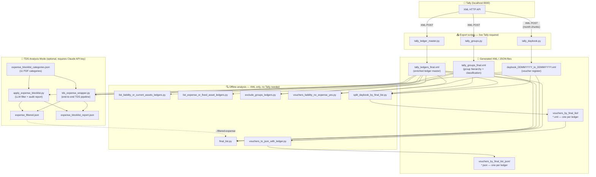

# TALLY_EXPORT


> **Python ETL toolkit for Tally Prime / Tally.ERP 9** — export groups, ledgers, and vouchers over the built-in XML HTTP API, then run rich offline analyses: ledger classification, tax-group closure, voucher pattern detection, and per-ledger JSON slicing.

---

## Table of Contents

- [Overview](#overview)
- [Features](#features)
- [Architecture](#architecture)
- [Prerequisites & Installation](#prerequisites--installation)
- [Quick Start](#quick-start)
- [Script Reference](#script-reference)
  - [0. run.py](#0-runpy--pipeline-orchestrator)
  - [1. tally_groups.py](#1-tally_groupspy--group-master--classification)
  - [2. tally_ledger_master.py](#2-tally_ledger_masterpy--ledger-master--enrichment)
  - [3. tally_daybook.py](#3-tally_daybookpy--voucher-register)
  - [4. list_liability_or_current_assets_ledgers.py](#4-list_liability_or_current_assets_ledgerspy)
  - [5. list_expense_or_fixed_asset_ledgers.py](#5-list_expense_or_fixed_asset_ledgerspy)
  - [6. exclude_groups_ledgers.py](#6-exclude_groups_ledgerspy--exclude-groups-closure)
  - [7. vouchers_liability_no_expense_yes.py](#7-vouchers_liability_no_expense_yespy--cross-voucher-pattern)
  - [8. final_list.py](#8-final_listpy--voucher-pattern-ledgers-minus-duties--taxes)
  - [9. split_daybook_by_final_list.py](#9-split_daybook_by_final_listpy--per-ledger-daybook-slices)
  - [10. vouchers_to_json_with_ledger.py](#10-vouchers_to_json_with_ledgerpy--json-with-ledger-master)
  - [11. apply_expense_blocklist.py](#11-apply_expense_blocklistpy--llm-blocklist-filter-tds-mode)
  - [12. tds_expense_wrapper.py](#12-tds_expense_wrapperpy--end-to-end-tds-orchestrator)
  - [13. expense_blocklist_categories.json](#13-expense_blocklist_categoriesjson--blocklist-config)
- [TDS Analysis Mode](#tds-analysis-mode)
- [Data File Reference](#data-file-reference)
- [Output Folder Structure](#output-folder-structure)
- [Key Design Patterns](#key-design-patterns)
- [Classification System](#classification-system)
- [JSON Output Structure](#json-output-structure)
- [What You Get (Example Scale)](#what-you-get-example-scale)
- [Troubleshooting](#troubleshooting)
- [Notes & Caveats](#notes--caveats)
- [License](#license)

---

## Overview

Tally Prime and Tally.ERP 9 expose an **XML HTTP API** on `localhost:9000` that can return group hierarchies, ledger masters, and voucher registers in XML format. This toolkit wraps that API with:

- **Export scripts** that pull data from a live Tally instance and write structured XML to disk.
- **Offline analysis scripts** that operate purely on those XML files — no Tally required — to classify ledgers, close the *Duties & Taxes* group tree, detect cross-entry voucher patterns, and produce per-ledger daybook slices with enriched JSON.

The entire pipeline is designed for **any Tally company and any date range**. Simply point the scripts at your Tally instance and the date range you need.

---

## Features

- **Complete group export** with automatic classification into `NATURE` (Asset / Liability / Income / Expense), `ROOTPRIMARY` (top-level group), and `FINANCIALSTATEMENT` (Balance Sheet / P&L).
- **Full ledger master export** with wide FETCH spec (GST, mailing, bank, tax details) and optional enrichment from the group hierarchy.
- **Chunked daybook export** — month-by-month to stay within Tally's HTTP timeout limits; deduplicates by GUID across chunks.
- **Ledger deduplication & merging** — normalises whitespace, merges duplicate ledger names with union semantics across scalar and list fields.
- **Streaming XML parsing** via `iterparse` + `elem.clear()` — handles multi-hundred-MB daybook files without loading the entire document into memory.
- **Exclude-groups BFS closure** — walks the group tree to collect all sub-groups of selected root groups (default: *Duties & Taxes*, *Cash-in-Hand*, *Bank Accounts*, *Branch / Divisions*), then lists ledgers whose parent sits in that set.
- **Cross-voucher pattern detection** — finds vouchers that simultaneously debit an expense/fixed-asset ledger and credit a liability/current-asset ledger.
- **Per-ledger daybook slicing** — one XML file per target ledger containing every voucher that references it.
- **JSON export with canonical field resolution** — resolves GST, PAN, state, pincode from multiple Tally storage locations; records `field_sources` for auditability.
- **Safe filename generation** — sanitises ledger names to valid filesystem paths with collision handling.

---

## Architecture



---

## Prerequisites & Installation

### Tally setup

1. Open your company in **Tally Prime** or **Tally.ERP 9**.
2. Go to **F12 Configure → Advanced Configuration** (or **Gateway of Tally → F12**).
3. Enable **"Allow TDL XML HTTP API"** (or **"Enable HTTP server"**) and note the port (default **9000**).
4. Tally must remain open and listening while export scripts run.

### Python environment

```bash
# Python 3.10+ required (uses X | Y type-union syntax)
python --version

# Install runtime dependencies (anthropic only needed for TDS Analysis Mode)
pip install -r requirements.txt
# or, if you don't need TDS mode:
pip install requests
```

### Get the code

```bash
git clone https://github.com/<your-username>/TALLY_EXPORT.git
cd TALLY_EXPORT
```

### Optional: Claude API key (only for TDS Analysis Mode)

The TDS workflow uses Claude to identify ledgers that should be excluded from
TDS analysis (discounts, GST components, statutory penalties, etc. — see the
[TDS Analysis Mode](#tds-analysis-mode) section below). You can skip this if
you only need the default voucher-pattern pipeline.

```bash
cp config/.env.example .env
# edit .env and paste your real ANTHROPIC_API_KEY
# get one at https://console.anthropic.com/

# the scripts read ANTHROPIC_API_KEY from the environment
export $(grep -v '^#' .env | xargs)
```

---

## Quick Start

**One command runs the full pipeline** from the repo root:

```bash
python run.py
```

`run.py` wires all phases together, passes the correct file paths automatically,
and streams progress to the terminal. All generated files land in `data/`.

### Common invocations

| Command | What it does |
|---------|-------------|
| `python run.py` | Standard offline pipeline — compute ledger list → split daybook → convert to JSON |
| `python run.py --tds` | TDS mode — LLM blocklist filter before voucher scan (needs `ANTHROPIC_API_KEY`) |
| `python run.py --tds --dry-run` | TDS dry-run — write audit report only, skip voucher scan |
| `python run.py --export` | Export from live Tally first, then run offline pipeline |
| `python run.py --export --start 01-04-2024 --end 31-03-2025` | Export with explicit date range, then pipeline |
| `python run.py --export --tds` | Export from Tally + TDS mode in one shot |

After a standard run you have (all inside `data/`):
- `data/final.txt` — sorted target ledger list
- `data/vouchers_by_final_list/` — one XML per target ledger
- `data/vouchers_by_final_list_json/` — one JSON per target ledger

After `--tds` you additionally get:
- `data/expense_filtered.json` — expense ledgers with blocklisted names removed
- `data/expense_blocklist_report.json` — per-name LLM audit report

> **Tip — TDS first time:** run `python run.py --tds --dry-run` first, review
> `data/expense_blocklist_report.json`, then run `python run.py --tds` for the
> full pipeline. The LLM cache makes every subsequent run byte-identical and free.

See [`run.py`](#0-runpy--pipeline-orchestrator) in Script Reference and
[TDS Analysis Mode](#tds-analysis-mode) for full details.

---

## Script Reference

### 0. `run.py` — Pipeline orchestrator

**Role:** Single entry point that runs the entire pipeline in the correct order.
Resolves all file paths automatically (everything reads from and writes to `data/`).
No `PYTHONPATH` setup needed — the individual scripts self-register their directories
at import time.

**CLI flags:**

| Flag | Default | Effect |
|---|---|---|
| `--export` | off | Run Tally export phase first (Tally must be open on `localhost:9000`) |
| `--start DD-MM-YYYY` | `01-04-2024` | Daybook start date (used with `--export`) |
| `--end DD-MM-YYYY` | `31-03-2025` | Daybook end date (used with `--export`) |
| `--tds` | off | Apply LLM expense blocklist before voucher scan (TDS mode) |
| `--dry-run` | off | TDS only — write audit report + filtered expense set, skip voucher scan |

**Run:**

```bash
# Standard offline pipeline (XMLs already in data/)
python run.py

# TDS mode
python run.py --tds
python run.py --tds --dry-run

# Export from Tally first, then offline pipeline
python run.py --export
python run.py --export --start 01-04-2024 --end 31-03-2025

# Export from Tally + TDS mode in one shot
python run.py --export --tds --start 01-04-2024 --end 31-03-2025
```

---

### 1. `tally_groups.py` — Group master + classification

**Role:** Fetches all Tally groups via a Collection XML request, walks each group's parent chain to its root primary group, and writes `tally_groups_final.xml` with enrichment tags added.

| Field added | Meaning |
|---|---|
| `ROOTPRIMARY` | Top-level ancestor (e.g. `Current Liabilities`, `Indirect Expenses`) |
| `NATURE` | `Asset` / `Liability` / `Income` / `Expense` / `Primary` |
| `FINANCIALSTATEMENT` | `Balance Sheet` / `P&L` / `Root` |

**Output:** `tally_groups_final.xml` — root `<TALLYGROUPS>`, children `<GROUP>`.

**Run:**

```bash
python export/tally_groups.py
```

> ⚠️ **Warning:** This script executes at import time (no `if __name__ == "__main__"` guard). Do **not** `import tally_groups` as a library unless you intend to trigger a live HTTP request.

**Downstream consumers:** `exclude_groups_ledgers.py`, `final_list.py`, `split_daybook_by_final_list.py`.

---

### 2. `tally_ledger_master.py` — Ledger master + enrichment

**Role:** Fetches all ledgers with a wide `<FETCH>` spec (GST, mailing, bank, income-tax details), optionally merges duplicate names, optionally enriches with `ROOTPRIMARY` / `NATURE` / `FINANCIALSTATEMENT`, and writes `tally_ledgers_final.xml`.

**Default output:** `tally_ledgers_final.xml` — root `<TALLYLEDGERS>`, children `<LEDGER>` in native Tally subtree format.

**CLI flags:**

| Flag | Default | Effect |
|---|---|---|
| `--out PATH` | `tally_ledgers_final.xml` | Override output path |
| `--no-enrich` | enrichment on | Skip adding ROOTPRIMARY / NATURE |
| `--legacy-flat` | off | Use flat field list instead of native subtrees |
| `--beautify` | on | Strip `TYPE` attributes from XML |

**Run:**

```bash
python export/tally_ledger_master.py
python export/tally_ledger_master.py --out data/tally_ledgers_final.xml
python export/tally_ledger_master.py --no-enrich
python export/tally_ledger_master.py --legacy-flat
```

**Programmatic API:**

```python
from export.tally_ledger_master import export_ledgers_to_path
export_ledgers_to_path("my_ledgers.xml")
```

**Downstream consumers:** All offline analysis scripts.

---

### 3. `tally_daybook.py` — Voucher register

**Role:** Exports vouchers for a given date range by fetching **one calendar month at a time** (to avoid Tally HTTP timeouts). Deduplicates by `GUID` across chunks. Normalises the XML to `<TALLYDAYBOOK>` / `<VOUCHER>` / `<LEDGERENTRIES>` / `<ENTRY>`.

**Output:** `daybook_DDMMYYYY_to_DDMMYYYY.xml` (auto-named from date range, or `--out`).

**CLI flags:**

| Flag | Default | Effect |
|---|---|---|
| `--start DD-MM-YYYY` | required | First date of range |
| `--end DD-MM-YYYY` | required | Last date of range |
| `--out PATH` | auto from dates | Override output path |

**Run:**

```bash
python export/tally_daybook.py --start 01-04-2024 --end 31-03-2025
python export/tally_daybook.py --start 01-04-2024 --end 31-03-2025 --out data/daybook_01042024_to_31032025.xml
```

**Programmatic API:**

```python
from export.tally_daybook import export_daybook_to_path
export_daybook_to_path("01-04-2024", "31-03-2025", "my_daybook.xml")
```

> **Timeouts:** 900 s read timeout per monthly chunk. Very large companies may still need smaller ranges or TDL-level optimisation.

**Downstream consumers:** `vouchers_liability_no_expense_yes.py`, `final_list.py`, `split_daybook_by_final_list.py`.

---

### 4. `list_liability_or_current_assets_ledgers.py`

**Role:** Reads the enriched ledger XML and prints one ledger name per line for every ledger where:

- `NATURE == "Liability"`, **or**
- `ROOTPRIMARY == "Current Assets"`

**Default input:** `tally_ledgers_final.xml` in the current directory.

**Run:**

```bash
python classify/list_liability_or_current_assets_ledgers.py
python classify/list_liability_or_current_assets_ledgers.py data/tally_ledgers_final.xml
```

Uses `iterparse` — safe for large ledger files.

---

### 5. `list_expense_or_fixed_asset_ledgers.py`

**Role:** Same enrichment contract as script 4. Includes a ledger if:

- `NATURE == "Expense"`, **or**
- `ROOTPRIMARY == "Fixed Assets"`

Then excludes ledger names matching discount/round-off patterns:
- any name containing `discount` (for example `Discount`, `Discount Allowed`, `Discount Aalowed`)
- `round off` and `roundoff` variants (case-insensitive, spacing/punctuation tolerant)

**CLI flags:**

| Flag | Default | Effect |
|---|---|---|
| `--xml PATH` | `tally_ledgers_final.xml` | Ledger master path |
| `--json` | off | Output as JSON array instead of one-per-line |

**Run:**

```bash
python classify/list_expense_or_fixed_asset_ledgers.py
python classify/list_expense_or_fixed_asset_ledgers.py --xml data/tally_ledgers_final.xml --json
```

---

### 6. `exclude_groups_ledgers.py` — Exclude-groups closure

**Role:**

1. Reads `tally_groups_final.xml` and performs a **BFS** over parent → child links to collect the full set of groups under selected root groups (default: **`Duties & Taxes`**, **`Cash-in-Hand`**, **`Bank Accounts`**, **`Branch / Divisions`**).
2. Reads `tally_ledgers_final.xml` and lists every ledger whose `PARENT` field appears in that group set.

**CLI flags:**

| Flag | Default | Effect |
|---|---|---|
| `--groups-xml PATH` | `tally_groups_final.xml` | Group hierarchy file |
| `--ledgers-xml PATH` | `tally_ledgers_final.xml` | Ledger master file |
| `--groups-only` | off | Print group names only (no ledgers) |
| `-v` | off | Verbose BFS level debugging |
| `--roots GROUP [GROUP ...]` | default root list | Override / extend root groups to include in closure |

**Run:**

```bash
python classify/exclude_groups_ledgers.py
python classify/exclude_groups_ledgers.py --groups-only -v
python classify/exclude_groups_ledgers.py --groups-xml data/tally_groups_final.xml --ledgers-xml data/tally_ledgers_final.xml
python classify/exclude_groups_ledgers.py --roots "Duties & Taxes" "Cash-in-Hand" "Bank Accounts" "Branch / Divisions"
```

**Downstream consumers:** `final_list.py` (uses its output as the exclusion set).

---

### 7. `vouchers_liability_no_expense_yes.py` — Cross-voucher pattern

**Role:** Detects vouchers that match **both** of these conditions simultaneously:

1. At least one entry credits a **liability / current-asset** ledger (`ISDEEMEDPOSITIVE == "No"`)
2. At least one entry debits an **expense / fixed-asset** ledger (`ISDEEMEDPOSITIVE == "Yes"`),
   after excluding discount/round-off ledger names (`discount*`, `round off`, `roundoff`)

Prints the **distinct liability/current-asset ledger names** from all matching vouchers, sorted.

**CLI flags:**

| Flag | Default | Effect |
|---|---|---|
| `--ledgers PATH` | `tally_ledgers_final.xml` | Enriched ledger master |
| `--daybook PATH` | `daybook_01042024_to_31032025.xml` | Daybook XML |
| `--json` | off | Output as JSON array |
| `-o PATH` | `test.txt` | Write output to file instead of stdout |
| `--filtered-expense PATH` | (none) | **Explicit TDS override:** load the expense_or_fixed set from this file (JSON array or one-name-per-line text). Beats auto-detect. |
| `--no-filter` | off | Force raw-XML classification even if `expense_filtered.json` exists next to the ledgers XML. Use for non-TDS runs. |

**Run:**

```bash
python vouchers/vouchers_liability_no_expense_yes.py \
  --ledgers data/tally_ledgers_final.xml \
  --daybook data/daybook_01042024_to_31032025.xml
python vouchers/vouchers_liability_no_expense_yes.py \
  --ledgers data/tally_ledgers_final.xml \
  --daybook data/daybook_01042024_to_31032025.xml --json

# TDS mode — explicit override
python vouchers/vouchers_liability_no_expense_yes.py \
  --ledgers data/tally_ledgers_final.xml \
  --daybook data/daybook_01042024_to_31032025.xml \
  --filtered-expense data/expense_filtered.json

# Force raw XML even if a sidecar exists
python vouchers/vouchers_liability_no_expense_yes.py \
  --ledgers data/tally_ledgers_final.xml \
  --daybook data/daybook_01042024_to_31032025.xml --no-filter
```

**Architecture note — single source of truth + auto-detect.** Every other
script in the pipeline that needs an expense set (`final_list.py`,
`split_daybook_by_final_list.py`, `tds_expense_wrapper.py`) imports
`load_expense_and_liability_sets()` from this module. The override hook lives
inside that function, so `--filtered-expense`, `--no-filter`, and the
auto-detect behavior all work the same way everywhere — there's exactly one
piece of code that knows how to pick the expense source.

**Auto-detect: how the expense source is chosen** (resolution order):

| Priority | Condition | Source |
|---|---|---|
| 1 | `--filtered-expense FILE` is passed | The given file |
| 2 | `--no-filter` is passed | Raw XML extraction |
| 3 | `expense_filtered.json` exists next to the ledgers XML | The sidecar (auto-detected) |
| 4 | None of the above | Raw XML extraction |

Every run logs the resolved source on stderr (e.g.
`[vouchers_liability_no_expense_yes] Auto-detected filter sidecar: expense_filtered.json (next to ledgers XML).`)
so the audit trail is in stdout/stderr regardless of how the script was invoked.

**Staleness check.** If the auto-detected sidecar is older than the ledgers
XML (i.e. you re-exported from Tally but didn't re-run `apply_expense_blocklist.py`),
a loud `WARNING` line is printed but the run continues using the existing
sidecar. Re-run `apply_expense_blocklist.py` to refresh. Pass `--no-filter` to
ignore the sidecar entirely.

**Downstream consumers:** `final_list.py`, `split_daybook_by_final_list.py`,
`tds_expense_wrapper.py` (all import `load_expense_and_liability_sets` and
`collect_matching_liability_names` from this module).

---

### 8. `final_list.py` — Voucher-pattern ledgers minus excluded groups

**Role:** Produces the **set difference**:

```
voucher_pattern_ledgers  −  excluded_group_ledgers
```

Internally reimplements the logic of both `vouchers_liability_no_expense_yes.py` and `exclude_groups_ledgers.py` — no shell pipe required.

**CLI flags:**

| Flag | Default | Effect |
|---|---|---|
| `--ledgers PATH` | `tally_ledgers_final.xml` | Ledger master |
| `--daybook PATH` | `daybook_01042024_to_31032025.xml` | Daybook XML |
| `--groups-xml PATH` | `tally_groups_final.xml` | Group hierarchy |
| `--filtered-expense PATH` | (none) | **Explicit TDS override:** load the expense_or_fixed set from this file. Beats auto-detect. |
| `--no-filter` | off | Force raw-XML classification even if `expense_filtered.json` exists next to the ledgers XML. Use for non-TDS runs while a sidecar is present. |
| `--json` | off | Output as JSON array |

**Run:**

```bash
python vouchers/final_list.py \
  --ledgers data/tally_ledgers_final.xml \
  --daybook data/daybook_01042024_to_31032025.xml \
  --groups-xml data/tally_groups_final.xml
python vouchers/final_list.py \
  --ledgers data/tally_ledgers_final.xml \
  --daybook data/daybook_01042024_to_31032025.xml \
  --groups-xml data/tally_groups_final.xml --json

# Save to file
python vouchers/final_list.py \
  --ledgers data/tally_ledgers_final.xml \
  --daybook data/daybook_01042024_to_31032025.xml \
  --groups-xml data/tally_groups_final.xml > data/final.txt

# TDS workflow: apply the blocklist, review the report, then run final_list — auto-detect picks up the sidecar
python tds/apply_expense_blocklist.py --input expense_raw.json \
  --output data/expense_filtered.json --report data/expense_blocklist_report.json
# (review data/expense_blocklist_report.json)
python vouchers/final_list.py \
  --ledgers data/tally_ledgers_final.xml \
  --daybook data/daybook_01042024_to_31032025.xml \
  --groups-xml data/tally_groups_final.xml  # auto-detects expense_filtered.json next to the ledgers XML
```

**Downstream consumers:** `split_daybook_by_final_list.py` (applies this list programmatically without calling `final_list.py`).

---

### 9. `split_daybook_by_final_list.py` — Per-ledger daybook slices

**Role:** Computes the same **final list** as `final_list.py` (programmatically), scans the daybook **once**, and writes **one `<TALLYDAYBOOK>` XML file per ledger name** containing every voucher that references that ledger (by `LEDGERNAME` or `PARTYLEDGERNAME`).

**Output:** `vouchers_by_final_list/` folder — one `.xml` per ledger.  
Each file root carries `FROMDATE`, `TODATE`, and `TOTALCOUNT` attributes.  
Filenames are **sanitised** (`<>:"/\|?*` → `_`) with `_2`, `_3` suffixes on collision.

**CLI flags:**

| Flag | Default | Effect |
|---|---|---|
| `--ledgers PATH` | `tally_ledgers_final.xml` | Ledger master |
| `--daybook PATH` | `daybook_01042024_to_31032025.xml` | Daybook XML |
| `--groups-xml PATH` | `tally_groups_final.xml` | Group hierarchy |
| `--out-dir PATH` | `vouchers_by_final_list` | Output folder |
| `--filtered-expense PATH` | (none) | **Explicit TDS override:** load the expense_or_fixed set from this file. Beats auto-detect. |
| `--no-filter` | off | Force raw-XML classification even if `expense_filtered.json` is auto-detected next to the ledgers XML. |

**Run:**

```bash
python vouchers/split_daybook_by_final_list.py \
  --ledgers data/tally_ledgers_final.xml \
  --daybook data/daybook_01042024_to_31032025.xml \
  --groups-xml data/tally_groups_final.xml \
  --out-dir data/vouchers_by_final_list

# TDS mode — auto-detects expense_filtered.json next to the ledgers XML
python vouchers/split_daybook_by_final_list.py \
  --ledgers data/tally_ledgers_final.xml \
  --daybook data/daybook_01042024_to_31032025.xml \
  --groups-xml data/tally_groups_final.xml \
  --out-dir data/vouchers_by_final_list

# Force raw XML even if a sidecar is present
python vouchers/split_daybook_by_final_list.py \
  --ledgers data/tally_ledgers_final.xml \
  --daybook data/daybook_01042024_to_31032025.xml \
  --groups-xml data/tally_groups_final.xml \
  --out-dir data/vouchers_by_final_list --no-filter
```

**Downstream consumers:** `vouchers_to_json_with_ledger.py`.

---

### 10. `vouchers_to_json_with_ledger.py` — JSON with ledger master

**Role:** Converts each `vouchers_by_final_list/*.xml` to a structured JSON file. Parses `tally_ledgers_final.xml` **once** and resolves canonical values for GST, PAN, address, and registration from multiple Tally storage locations.

**JSON output per file:**

```
{
  "ledger_master": { ... resolved fields + field_sources ... },
  "daybook":       { ... vouchers as JSON ... }
}
```

**Field resolution priority:**

| Field | Priority order |
|---|---|
| `GSTIN` | `PARTYGSTIN` → `LEDGSTREGDETAILS.LIST[n].GSTIN` |
| `PAN` | `INCOMETAXNUMBER` from multiple blocks (all distinct recorded) |
| `STATE` | `PRIORSTATENAME` → `LEDMAILINGDETAILS` → `LEDGSTREGDETAILS` |
| `PINCODE` | Direct `PINCODE` → `LEDMAILINGDETAILS.PINCODE` |

When Tally stores **multiple distinct values** for the same concept, the script emits `GSTIN_all_distinct` / `PAN_all_distinct` alongside the canonical choice.

**CLI flags:**

| Flag | Default | Effect |
|---|---|---|
| `--ledgers PATH` | `tally_ledgers_final.xml` | Ledger master |
| `--vouchers-dir PATH` | `vouchers_by_final_list` | Input XML folder |
| `--output-dir PATH` | `vouchers_by_final_list_json` | Output JSON folder |
| `--dry-run` | off | Parse only, do not write files |

**Run:**

```bash
python vouchers/vouchers_to_json_with_ledger.py \
  --ledgers data/tally_ledgers_final.xml \
  --vouchers-dir data/vouchers_by_final_list \
  --output-dir data/vouchers_by_final_list_json
python vouchers/vouchers_to_json_with_ledger.py \
  --ledgers data/tally_ledgers_final.xml \
  --vouchers-dir data/vouchers_by_final_list \
  --output-dir data/vouchers_by_final_list_json --dry-run
```

> **Note:** If a file stem does not match any `<LEDGER NAME="...">` in the master (e.g. after a ledger rename), `ledger_master` will include a `_lookup_error` key instead of resolved fields.

---

### 11. `apply_expense_blocklist.py` — LLM blocklist filter (TDS mode)

**Role:** Reads a list of ledger names (the output of
`list_expense_or_fixed_asset_ledgers.py`, or any JSON array / one-name-per-line
text file) and uses Claude (Anthropic API) to identify which names fall under
any of the 11 blocklist categories defined in `expense_blocklist_categories.json`
(discount, round-off, bad debts, P&L on sale of asset, prior period, write-off,
bank charges, late fees & penalties, GST, income tax, ESI/PF). Writes a
filtered list (input minus blocklisted) plus a per-ledger audit report.

**Why pure-LLM, not regex:** the PDF rules carry explicit nuances that defeat
keyword matching — `purchase-GST` is not a GST blocklist (it's a purchase
ledger), `Tax Audit Fees` is not Income Tax (it's professional fees, TDS u/s
194J), `Interest paid to Vendor X` is not statutory (TDS u/s 194A). Sending
every name through Claude with the full PDF intents in the system prompt
applies these nuances uniformly.

**Safeguards:**

- `claude-opus-4-7` with adaptive thinking — the model reasons through edge cases
- Forced tool use with strict JSON schema — model cannot drift to free-form output
- Persistent JSON cache (`expense_blocklist_cache.json`) — re-runs are byte-identical and free
- Prompt caching on the system prompt — second batch onward is much cheaper
- Audit report has `name | blocklisted | category | reason | source` for every input
- Default bias toward keep — when ambiguous, the prompt explicitly instructs `blocklisted=false`
- Defensive guard — if the model returns an invalid category, the script overrides to keep

**CLI flags:**

| Flag | Default | Effect |
|---|---|---|
| `--input PATH` | required | JSON array or one-name-per-line text file of ledger names |
| `--config PATH` | `expense_blocklist_categories.json` | Categories config |
| `--output PATH` | `expense_filtered.json` | Filtered list (input minus blocklisted) |
| `--report PATH` | `expense_blocklist_report.json` | Per-name audit report |
| `--cache PATH` | `expense_blocklist_cache.json` | Persistent decision cache |
| `--model NAME` | `claude-opus-4-7` | Anthropic model ID |
| `--batch-size N` | 25 | Names per LLM call |
| `--max-tokens N` | 32000 | Output cap per batch (streaming used) |
| `--text` | off | Write `--output` as one name per line instead of JSON array |
| `--dry-run` | off | Write only the audit report; do not write the filtered list |

**Run:**

```bash
# 1. Produce the raw expense list
python classify/list_expense_or_fixed_asset_ledgers.py \
  --xml data/tally_ledgers_final.xml --json > expense_raw.json

# 2. First time: dry-run, review the report
python tds/apply_expense_blocklist.py --input expense_raw.json \
  --config config/expense_blocklist_categories.json --dry-run

# 3. Inspect expense_blocklist_report.json — names containing 'tax' or 'gst'
#    deserve special attention. Confirm Tax Audit Fees / purchase-GST / interest-on-loan
#    are all marked blocklisted=false.

# 4. Run for real (cache makes this byte-identical and free on later runs)
python tds/apply_expense_blocklist.py --input expense_raw.json \
  --config config/expense_blocklist_categories.json \
  --output data/expense_filtered.json \
  --report data/expense_blocklist_report.json
```

**Cheap / fast mode (no per-name reasoning):**

```bash
# ~$0.05–0.10, ~30–60 seconds for ~1500 ledgers
python tds/apply_expense_blocklist.py --input expense_raw.json \
    --config config/expense_blocklist_categories.json \
    --output data/expense_filtered.json \
    --model claude-haiku-4-5 \
    --no-thinking \
    --no-reasons \
    --batch-size 100 \
    --concurrency 5
```

The cheap-mode flags trade per-name LLM reasoning for ~50–100× lower cost and
much faster wall-clock time:

| Flag | Default | Effect |
|---|---|---|
| `--no-thinking` | off | Disable adaptive thinking. Required for Haiku 4.5 / Sonnet 4.5; saves the bulk of the output cost on Opus / Sonnet 4.6. |
| `--no-reasons` | off | Drop the per-name `reason` field from the LLM tool schema. Audit report falls back to a synthesized category-level reason (the PDF intent text). Cuts decision tokens ~5×. |
| `--concurrency N` | 1 | Run N batches in parallel via `ThreadPoolExecutor`. Linear wall-clock speedup until you hit Anthropic rate limits — try 5. |

When `--no-reasons` is set, each report entry looks like:
```json
{"name": "Bank Charges - HDFC", "blocklisted": true, "category": 7,
 "reason": "PDF cat 7: Ledgers that record fees levied directly by banks..."}
```
You still know *what* got blocked and *which category*; you just lose the
model's per-name justification. The category nuances (purchase-GST not blocked,
Tax Audit Fees not blocked, vendor interest not blocked) are still respected
because the system prompt still contains the full intent text.

**Environment:** Requires `ANTHROPIC_API_KEY` (see [Prerequisites](#prerequisites--installation)).

**Library use:** `from apply_expense_blocklist import filter_names, load_config` — `filter_names` takes a list of names and returns `(kept_names, audit_report)`.

**Downstream consumers:** `final_list.py --filtered-expense ...`, `tds_expense_wrapper.py` (uses `filter_names` internally).

---

### 12. `tds_expense_wrapper.py` — End-to-end TDS orchestrator

**Role:** One-command end-to-end pipeline for TDS analysis. Combines:
1. The `vouchers_liability_no_expense_yes.py` ledger classification (imported, not duplicated)
2. The `apply_expense_blocklist.py` LLM filter (imported, applied to the expense set)
3. The voucher scan (same `collect_matching_liability_names` as `final_list.py`)
4. The duties/cash/bank/branch group exclusion (same `exclude_groups_ledgers` as `final_list.py`)

Produces the same kind of output `final_list.py` produces — a sorted list of
liability/current-asset ledger names suitable for `split_daybook_by_final_list.py`
— but with TDS-irrelevant ledgers stripped before the voucher scan.

**No existing script is modified** — the wrapper imports public functions from
`vouchers_liability_no_expense_yes.py`, `exclude_groups_ledgers.py`, and
`apply_expense_blocklist.py`, then composes them.

**CLI flags:**

| Flag | Default | Effect |
|---|---|---|
| `--ledgers PATH` | `tally_ledgers_final.xml` | Ledger master |
| `--daybook PATH` | `daybook_01042024_to_31032025.xml` | Daybook XML |
| `--groups-xml PATH` | `tally_groups_final.xml` | Group hierarchy (for Stage 4 exclusion) |
| `--config PATH` | `expense_blocklist_categories.json` | Blocklist categories |
| `--output PATH` | `test_filtered.txt` | Final ledger-name list (sorted) |
| `--report PATH` | `expense_blocklist_report.json` | LLM audit report |
| `--filtered-expense PATH` | `expense_filtered.json` | Intermediate: blocklisted expense set (for diffing) |
| `--cache PATH` | `expense_blocklist_cache.json` | Persistent LLM cache |
| `--model NAME` | `claude-opus-4-7` | Anthropic model ID |
| `--batch-size N` | 25 | Names per LLM call |
| `--max-tokens N` | 32000 | Output cap per batch |
| `--json` | off | Write `--output` as a sorted JSON array |
| `--no-group-exclusion` | off | Skip Stage 4 (duties/cash/bank/branch exclusion) |
| `--dry-run` | off | Run only Stages 1 & 2; write the report and filtered set, skip voucher scan |

**Run:**

```bash
# Recommended first-time flow
python tds/tds_expense_wrapper.py --dry-run \
  --ledgers data/tally_ledgers_final.xml \
  --daybook data/daybook_01042024_to_31032025.xml \
  --groups-xml data/tally_groups_final.xml \
  --config config/expense_blocklist_categories.json
# (review data/expense_blocklist_report.json)
python tds/tds_expense_wrapper.py \
  --ledgers data/tally_ledgers_final.xml \
  --daybook data/daybook_01042024_to_31032025.xml \
  --groups-xml data/tally_groups_final.xml \
  --config config/expense_blocklist_categories.json
```

**Environment:** Requires `ANTHROPIC_API_KEY`.

**Downstream consumers:** `split_daybook_by_final_list.py` (consumes `test_filtered.txt`).

---

### 13. `expense_blocklist_categories.json` — Blocklist config

A static JSON file transcribing the 11 PDF blocklist categories (intent text +
reference keywords). Read by both `apply_expense_blocklist.py` and
`tds_expense_wrapper.py`. Edit this file to adjust the category definitions or
keywords. The file is the single source of truth — both the LLM system prompt
and the audit report's category numbers are derived from it.

**Schema:**

```json
[
  {
    "id": 1,
    "name": "Discount allowed and received",
    "intent": "Ledgers that record trade or cash discounts ... No TDS applies because no service is being rendered — it's simply a price reduction.",
    "keywords": ["discount allowed", "discount received", ...]
  },
  ...
]
```

The `keywords` array is illustrative — the LLM judges by intent, not keyword
match. The keywords are surfaced in the system prompt to anchor the model's
understanding of each category.

---

## TDS Analysis Mode

This is an optional second pipeline that produces a TDS-filtered final ledger
list. Use it when the downstream JSON will feed a TDS analysis under the
Indian Income Tax Act and you want to exclude ledgers that are technically
"Expense" in Tally but not TDS-relevant (discounts, GST components, statutory
penalties, ESI/PF, etc.).

### What gets blocklisted

The 11 categories from `expense_blocklist_categories.json`:

| # | Category | Why excluded |
|---|---|---|
| 1 | Discount allowed/received | Contra-revenue adjustment, no service rendered |
| 2 | Round off | Mathematical balancing, no payee |
| 3 | Bad debts & provision | Internal write-off, no payment |
| 4 | P&L on sale of asset | Notional accounting entry, no payee |
| 5 | Prior period expense | TDS attached to the original (earlier) period |
| 6 | Write-off ledgers | Internal adjustment, no external party |
| 7 | Bank charges | Bank fees aren't TDS deductee payments |
| 8 | Late fees & penalties | Statutory dues outside TDS framework |
| 9 | GST ledgers in expenses | Tax to government, not vendor payment |
| 10 | Income tax | Direct tax to government |
| 11 | ESI & PF | Statutory payroll-linked, separate statute |

### Two ways to run it

**Option A — one command (recommended).** `run.py --tds` does everything
end-to-end: classify ledgers, apply LLM blocklist, scan vouchers, apply group
exclusion, write final list and JSON slices.

```bash
# First time: dry-run to produce the audit report only
python run.py --tds --dry-run
# (review data/expense_blocklist_report.json)

# When satisfied: full pipeline — cache makes re-runs byte-identical and free
python run.py --tds
```

**Option B — manual review at each step.** Useful if you want to inspect or
hand-edit `expense_filtered.json` between the LLM filter and the voucher scan.
Thanks to **auto-detect**, once `expense_filtered.json` is written into `data/`,
every downstream script picks it up automatically — no extra flags needed.

```bash
# 1. Produce raw expense list
python classify/list_expense_or_fixed_asset_ledgers.py \
  --xml data/tally_ledgers_final.xml --json > expense_raw.json

# 2. LLM filter — writes data/expense_filtered.json + data/expense_blocklist_report.json
python tds/apply_expense_blocklist.py --input expense_raw.json \
  --config config/expense_blocklist_categories.json \
  --output data/expense_filtered.json \
  --report data/expense_blocklist_report.json

# 3. (Optional) inspect or hand-edit data/expense_filtered.json

# 4. Run the rest of the pipeline — auto-detects the sidecar
python run.py
```

Each downstream script logs the source it's using on stderr so you can confirm:
```
[vouchers_liability_no_expense_yes] Auto-detected filter sidecar: expense_filtered.json (next to ledgers XML).
[vouchers_liability_no_expense_yes] Loaded 1652 filtered expense names from expense_filtered.json.
```

To **opt out of auto-detect** (e.g. one-off non-TDS run while a sidecar exists),
run `run.py` without `--tds` — it calls `final_list.py` which ignores the sidecar
by default unless TDS mode is active. Or pass `--no-filter` directly to any
individual script:</p>

```bash
python vouchers/final_list.py \
  --ledgers data/tally_ledgers_final.xml \
  --daybook data/daybook_01042024_to_31032025.xml \
  --groups-xml data/tally_groups_final.xml --no-filter
```

### Caveats

- **First run is non-deterministic-feeling.** The LLM cache makes subsequent
  runs byte-identical, but the very first pass over a fresh ledger set will
  produce *one* set of decisions. Always start with `--dry-run` and review the
  audit report before trusting the filtered output.
- **Cache must be deleted to force a re-classification** of a ledger whose
  decision you disagree with. Edit `expense_blocklist_cache.json` to remove
  the entry, then re-run.
- **The blocklist runs before the voucher scan.** If a blocklisted ledger only
  ever appears in vouchers that don't match the "expense Yes + liability No"
  pattern, removing it has no observable effect on the final output. The cost
  is borne in the LLM call regardless.
- **`expense_blocklist_categories.json` is the source of truth.** If your CA's
  guidance changes, edit this file and delete the cache to re-classify.
- **Cost.** A fresh run on ~1500 ledgers costs roughly $3–5 in Claude API
  usage (model: `claude-opus-4-7`). After the cache fills, re-runs are free.

---

## Data File Reference

| File | Produced by | Root element | Contents |
|---|---|---|---|
| `tally_groups_final.xml` | `tally_groups.py` | `<TALLYGROUPS>` | Group tree with `NATURE`, `ROOTPRIMARY`, `FINANCIALSTATEMENT` |
| `tally_ledgers_final.xml` | `tally_ledger_master.py` | `<TALLYLEDGERS>` | Enriched ledger master (GST, mailing, bank, tax, classification) |
| `daybook_DDMMYYYY_to_DDMMYYYY.xml` | `tally_daybook.py` | `<TALLYDAYBOOK>` | Deduplicated voucher register for the requested date range |
| `vouchers_by_final_list/*.xml` | `split_daybook_by_final_list.py` | `<TALLYDAYBOOK>` | Per-ledger slice — all vouchers referencing that ledger |
| `vouchers_by_final_list_json/*.json` | `vouchers_to_json_with_ledger.py` | JSON object | `ledger_master` + `daybook` keys |
| `expense_blocklist_categories.json` | (committed) | JSON array | The 11 TDS blocklist categories — intent + keywords |
| `expense_filtered.json` | `apply_expense_blocklist.py` / `tds_expense_wrapper.py` | JSON array | Expense set with blocklisted names removed |
| `expense_blocklist_report.json` | `apply_expense_blocklist.py` / `tds_expense_wrapper.py` | JSON array | Per-name audit: blocklisted, category, reason, source |
| `expense_blocklist_cache.json` | `apply_expense_blocklist.py` / `tds_expense_wrapper.py` | JSON object | Persistent decision cache (key = lowercased name) |
| `test_filtered.txt` | `tds_expense_wrapper.py` | text (one name per line) | Final TDS-filtered ledger list — use as input to `split_daybook_by_final_list.py` |

---

## Output Folder Structure

```
TALLY_EXPORT/
│
├── export/                                     ← Phase 1: live Tally connection scripts
│   ├── tally_groups.py
│   ├── tally_ledger_master.py
│   └── tally_daybook.py
│
├── classify/                                   ← Phase 2: offline ledger classification
│   ├── list_liability_or_current_assets_ledgers.py
│   ├── list_expense_or_fixed_asset_ledgers.py
│   └── exclude_groups_ledgers.py
│
├── vouchers/                                   ← Phase 3: voucher pattern & slicing
│   ├── vouchers_liability_no_expense_yes.py
│   ├── final_list.py
│   ├── split_daybook_by_final_list.py
│   └── vouchers_to_json_with_ledger.py
│
├── tds/                                        ← Phase 4 (optional): LLM-based TDS analysis
│   ├── apply_expense_blocklist.py
│   └── tds_expense_wrapper.py
│
├── config/                                     ← Static config inputs (committed)
│   ├── expense_blocklist_categories.json       ← TDS mode: 11 PDF categories
│   └── .env.example                            ← template for ANTHROPIC_API_KEY
│
├── data/                                       ← ALL generated outputs (gitignored)
│   ├── tally_groups_final.xml                  ← generated by export/tally_groups.py
│   ├── tally_ledgers_final.xml                 ← generated by export/tally_ledger_master.py
│   ├── daybook_DDMMYYYY_to_DDMMYYYY.xml        ← generated by export/tally_daybook.py
│   ├── final.txt                               ← generated by vouchers/final_list.py
│   ├── expense_filtered.json                   ← TDS mode: blocklist-filtered expense set
│   ├── expense_blocklist_report.json           ← TDS mode: per-name audit report
│   ├── expense_blocklist_cache.json            ← TDS mode: persistent LLM decision cache
│   ├── test_filtered.txt                       ← TDS mode: final ledger list from tds_expense_wrapper.py
│   ├── vouchers_by_final_list/                 ← generated by vouchers/split_daybook_by_final_list.py
│   │   ├── Creditor A.xml
│   │   ├── Creditor B.xml
│   │   └── ...  (one file per target ledger)
│   └── vouchers_by_final_list_json/            ← generated by vouchers/vouchers_to_json_with_ledger.py
│       ├── Creditor A.json
│       ├── Creditor B.json
│       └── ...  (one file per target ledger)
│
├── requirements.txt                            ← runtime deps (requests + anthropic)
└── README.md
```

---

## Key Design Patterns

### 1. XML Sanitisation (`clean_tally_xml`)

Tally's XML responses frequently contain characters that are illegal in standard XML. A shared `clean_tally_xml()` function handles:

| Problem | Fix |
|---|---|
| Illegal decimal/hex char references (`&#0;`–`&#8;`) | Removed |
| Unescaped ampersands (`&`) | Replaced with `&amp;` when not already escaped |
| Raw control characters (0x00–0x1F) | Stripped |
| Namespace prefixes and `xmlns` declarations | Removed |

This sanitiser runs on the raw HTTP response string before any XML parsing.

---

### 2. Streaming Parse (`iterparse` + `elem.clear()`)

Daybook files can be hundreds of megabytes. All scripts that scan the daybook or ledger master use `xml.etree.ElementTree.iterparse` and call `elem.clear()` after processing each element to release memory immediately — the entire document is never held in RAM at once.

---

### 3. Ledger Deduplication & Merge

`tally_ledger_master.py` normalises ledger names (collapses whitespace) and detects duplicates. When two ledger records share the same normalised name:

- **Scalar fields:** Non-empty value preferred; if both non-empty and different, values are joined with `" | "`.
- **List fields (`*.LIST`):** Child rows are unioned; duplicate subtrees are skipped.

---

### 4. Voucher Pattern Matching

`vouchers_liability_no_expense_yes.py` (and its descendants) classify each `<ENTRY>` line by cross-referencing the line's `LEDGERNAME` against two pre-built ledger sets, then checks `ISDEEMEDPOSITIVE`:

```
ISDEEMEDPOSITIVE = "Yes"  →  debit-like  (increases asset / decreases liability)
ISDEEMEDPOSITIVE = "No"   →  credit-like (decreases asset / increases liability)
```

A voucher **matches** only if it contains **both**:
- An entry with `ISDEEMEDPOSITIVE == "Yes"` on an **expense or fixed-asset** ledger
  (excluding `discount*` and `round off` / `roundoff` names), **and**
- An entry with `ISDEEMEDPOSITIVE == "No"` on a **liability or current-asset** ledger.

The output collects the liability/current-asset names from condition 2, unioned across all matching vouchers.

---

### 5. Field Resolution Cascade

Tally stores the same business identifier (GSTIN, PAN, state) in multiple XML paths for historical reasons. `vouchers_to_json_with_ledger.py` checks each path in priority order, uses the first non-empty value as canonical, and records the winning path in `field_sources` — so you can trace exactly where each value came from.

---

### 6. Filename Sanitisation + Collision Handling

Ledger names often contain characters that are illegal in filenames (`< > : " / \ | ? *`). The splitter replaces all such characters with `_`. If two distinct ledger names produce the same sanitised filename, subsequent files are suffixed `_2`, `_3`, etc.

---

## Classification System

Both `tally_groups.py` and `tally_ledger_master.py` use the same hard-coded mapping from Tally's built-in primary groups to enrichment fields:

| Tally Primary Group | NATURE | FINANCIALSTATEMENT | ROOTPRIMARY |
|---|---|---|---|
| Capital Account | Liability | Balance Sheet | Capital Account |
| Reserves & Surplus | Liability | Balance Sheet | Reserves & Surplus |
| Loans (Liability) | Liability | Balance Sheet | Loans (Liability) |
| Current Liabilities | Liability | Balance Sheet | Current Liabilities |
| Duties & Taxes | Liability | Balance Sheet | Duties & Taxes |
| Provisions | Liability | Balance Sheet | Provisions |
| Suspense A/c | Liability | Balance Sheet | Suspense A/c |
| Branch / Divisions | Liability | Balance Sheet | Branch / Divisions |
| Fixed Assets | Asset | Balance Sheet | Fixed Assets |
| Investments | Asset | Balance Sheet | Investments |
| Current Assets | Asset | Balance Sheet | Current Assets |
| Loans & Advances (Asset) | Asset | Balance Sheet | Loans & Advances (Asset) |
| Misc. Expenses (ASSET) | Asset | Balance Sheet | Misc. Expenses (ASSET) |
| Stock-in-Hand | Asset | Balance Sheet | Stock-in-Hand |
| Direct Income | Income | P&L | Direct Income |
| Indirect Income | Income | P&L | Indirect Income |
| Sales Accounts | Income | P&L | Sales Accounts |
| Direct Expenses | Expense | P&L | Direct Expenses |
| Indirect Expenses | Expense | P&L | Indirect Expenses |
| Purchase Accounts | Expense | P&L | Purchase Accounts |

> **Consistency note:** If you modify this mapping in one script, apply the same change in the other to keep `NATURE` / `ROOTPRIMARY` consistent between group and ledger exports.

---

## JSON Output Structure

Each file in `vouchers_by_final_list_json/` follows this shape:

```json
{
  "ledger_master": {
    "NAME": "ABC Traders",
    "PARENT": "Sundry Creditors",
    "NATURE": "Liability",
    "ROOTPRIMARY": "Current Liabilities",
    "FINANCIALSTATEMENT": "Balance Sheet",
    "GSTIN": "27ABCDE1234F1Z5",
    "PAN": "ABCDE1234F",
    "STATE": "Maharashtra",
    "PINCODE": "400001",
    "MAILINGNAME": "ABC Traders Pvt Ltd",
    "COUNTRY": "India",
    "GSTIN_all_distinct": ["27ABCDE1234F1Z5"],
    "PAN_all_distinct": ["ABCDE1234F"],
    "field_sources": {
      "GSTIN": "PARTYGSTIN",
      "PAN": "INCOMETAXNUMBER",
      "STATE": "LEDMAILINGDETAILS.STATENAME",
      "PINCODE": "PINCODE"
    }
  },
  "daybook": {
    "@FROMDATE": "01-04-2024",
    "@TODATE": "31-03-2025",
    "@TOTALCOUNT": "42",
    "VOUCHER": [
      {
        "@DATE": "20240415",
        "@VOUCHERNUMBER": "PUR/001",
        "@VOUCHERTYPE": "Purchase",
        "PARTYLEDGERNAME": "ABC Traders",
        "LEDGERENTRIES": {
          "ENTRY": [
            {
              "LEDGERNAME": "Purchase Accounts",
              "ISDEEMEDPOSITIVE": "Yes",
              "AMOUNT": "-50000.00"
            },
            {
              "LEDGERNAME": "ABC Traders",
              "ISDEEMEDPOSITIVE": "No",
              "AMOUNT": "50000.00"
            }
          ]
        }
      }
    ]
  }
}
```

**Key points:**
- XML attributes are prefixed with `@` (e.g. `@DATE`, `@VOUCHERTYPE`).
- Repeated `<VOUCHER>` elements become a JSON array.
- `field_sources` maps each resolved `ledger_master` field to the XML tag path that supplied the value.
- `_lookup_error` appears in `ledger_master` when the filename stem has no matching `<LEDGER NAME="...">` in the master file (e.g. after a ledger rename or stale split).

---

## What You Get (Example Scale)

The table below shows **typical** output sizes from one full financial year export. Your actual numbers will vary by company size and voucher volume.

| Artifact | Typical size | Notes |
|---|---|---|
| `tally_groups_final.xml` | 50 – 100 KB | Tally typically ships with 130 – 160 groups |
| `tally_ledgers_final.xml` | 5 – 20 MB | Scales with number of ledgers in the company |
| `daybook_*.xml` | 50 – 250 MB | Scales with total voucher count for the date range |
| `vouchers_by_final_list/` | Hundreds of XML files | One per target ledger after voucher-pattern filtering |
| `vouchers_by_final_list_json/` | Matching JSON files | Mirror structure of the XML folder |

**Why so many files?** The splitter creates one XML/JSON per ledger in the **final list** (voucher-pattern ledgers minus excluded-group ledgers). For a company with hundreds of trade creditors or receivables this produces hundreds of files — one per counterparty — ready for downstream import or audit.

---

## Troubleshooting

| Symptom | Likely cause | Fix |
|---|---|---|
| `requests.exceptions.ReadTimeout` during export | Tally timed out on a large response | Reduce the date range (smaller `--start` / `--end` window); consider quarterly chunks |
| Empty or malformed XML from Tally | HTTP server not enabled, or wrong port | In Tally go to **F12 → Advanced Configuration** and confirm the port (default 9000) |
| `xml.etree.ElementTree.ParseError` | Illegal characters survived `clean_tally_xml` | Inspect the raw response and extend the sanitiser regex |
| Ledger fields missing from output (no GSTIN etc.) | `FETCH` spec has fields unsupported by your Tally build | Comment out unknown field names in `tally_ledger_master.py`'s FETCH list |
| `_lookup_error` in JSON output | Ledger was renamed in Tally after the split was run | Re-run `split_daybook_by_final_list.py` then `vouchers_to_json_with_ledger.py` |
| Fewer output files than expected | Pattern filter found no matching vouchers for some ledgers | Verify the daybook date range covers the relevant transaction period |
| Filename collisions (`_2`, `_3` suffix files) | Two ledger names sanitise to the same string | Expected and handled automatically; both files are written correctly |
| Very slow daybook export | Large company with many vouchers per month | Normal — each month is a separate HTTP round-trip with a 900 s read timeout |

---

## Notes & Caveats

- **Single entry point:** `run.py` is the recommended way to run the pipeline. It handles file paths, phase ordering, and cross-module imports automatically. Individual scripts can still be run directly — they self-register their directories so no `PYTHONPATH` setup is needed.
- **Hardcoded endpoint:** All export scripts POST to `http://localhost:9000`. If Tally runs on a different port or remote host, update the URL constant in each export script.
- **No incremental sync:** Every export is a full pull. There is no delta-sync or checkpoint mechanism — re-run from scratch for updated data.
- **Consistency requirement:** The primary-group → NATURE mapping is duplicated in `export/tally_groups.py` and `export/tally_ledger_master.py` (`PRIMARY_NATURE` / `_get_root_primary`). If you add or rename a primary group, update **both** scripts to keep enrichment fields consistent.
- **Tally version compatibility:** The `FETCH` spec in `tally_ledger_master.py` targets recent Tally Prime builds. Older Tally.ERP 9 versions may not recognise all field names — remove unknown fields from the spec if the API returns an error response.
- **Large date ranges:** Even with a 900 s read timeout, very large companies exporting a full year may still experience timeouts. Use `--start` / `--end` with quarterly ranges if needed.
- **Offline after export:** Once the three master XML files exist in `data/`, all analysis and slicing scripts work entirely offline — no live Tally connection required.

---

## License

MIT License — see [LICENSE](LICENSE) for details.

---

*Built for Indian accounting data workflows. Contributions and issue reports welcome.*
